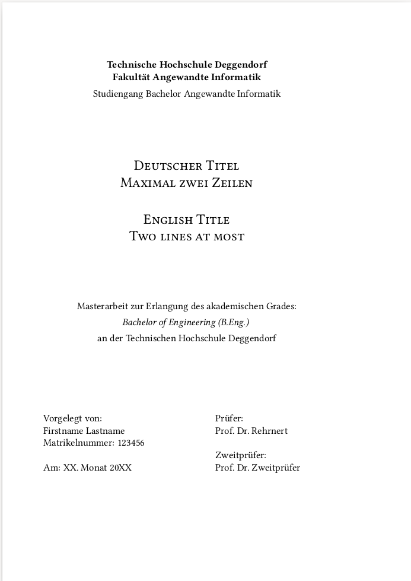

# Studienarbeiten

Dieses Repository enthält eine Vorlage für eine Studienarbeit in LaTeX. Der Student / die Studentin
muss in `thesis.tex` die Rahmendaten anpassen. Die eigentliche Arbeit kann in `main.tex`
oder (bei Bedarf) in weiteren `.tex`-Dateien erstellt werden. Die Arbeit kann mittels des Kommandos
`make` kompiliert werden. Die Vorlage entspricht vorrangig den Vorgaben der Fakultät AI, sollte aber
problemlos an andere Vorgaben anpassbar sein. Selbstverständlich sollte die Verwendung der Vorlage
sowie notwendige Anpassungen vorab mit dem Betreuer der Arbeit geklärt werden.

## Beispiel

---
© 2021 [Andreas Fischer](mailto:andreas.fischer@th-deg.de)

 Dieses Werk ist lizenziert unter einer <a rel="license" href="http://creativecommons.org/licenses/by-sa/4.0/">Creative Commons Namensnennung - Weitergabe unter gleichen Bedingungen 4.0 International Lizenz</a>.

Eine reine Erstellung einer Studienarbeit stellt noch keine Bearbeitung der Vorlage dar. Die entsprechende Studienarbeit unterliegt damit nicht der Vorgabe zur Weitergabe unter gleichen Bedingungen.
